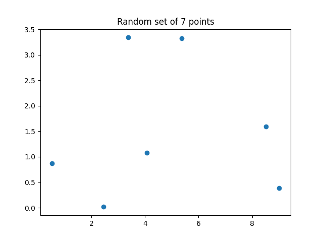
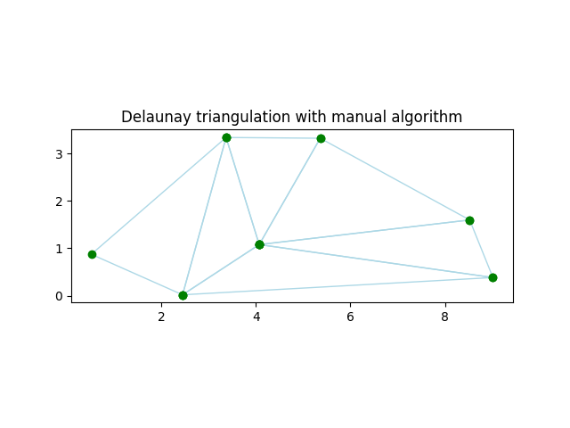
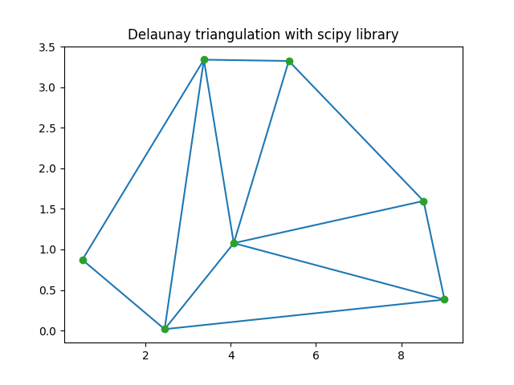

# Manual Delaunay triangulation using the Bowyer-Watson algorithm

The current project, developed for the Spatial Databases course, provides a manual implementation ofthe Delaunay algorithm on a random set of points.

From a random set of points like this:

the manual Delaunay triangulation is the following:

which is consistent with the Delaunay triangulation applied by the scipy library:

In the current implementation is possible to modify the following elements:
- minimum and maximum coordinates of the plane
- number of points to generate

Before running the code be sure to have installed are the ecessary libraries
